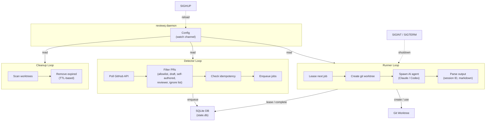

<div align="center">

  <h1>reviewq</h1>

  <h2>Automatic PR review queue powered by AI agents</h2>

  <div>
    <a href="https://github.com/K-dash/reviewq/blob/main/LICENSE"></a>
    <a href="https://www.rust-lang.org/"></a>
    <a href="https://github.com/K-dash/reviewq/graphs/commit-activity"></a>
  </div>

  <p>
    <a href="#features">Features</a>
    &#9670; <a href="#quick-start">Quick Start</a>
    &#9670; <a href="#usage">Usage</a>
    &#9670; <a href="#configuration">Configuration</a>
    &#9670; <a href="#architecture">Architecture</a>
  </p>
</div>

---

## Features

- **Automatic PR detection** &mdash; Polls GitHub for PRs where you are a requested reviewer
- **AI-powered reviews** &mdash; Triggers [Claude Code](https://docs.anthropic.com/en/docs/claude-code) or [Codex](https://openai.com/index/codex-cli/) agents to review code
- **Interactive TUI** &mdash; Monitor job queue, view review output, copy session IDs, and open PRs in browser
- **Hot-reloadable config** &mdash; Send `SIGHUP` to apply config changes without restarting
- **Per-repo policies** &mdash; Customize agent, model, prompt, and filtering rules per repository
- **Worktree isolation** &mdash; Each review runs in its own git worktree for safe concurrent execution
- **Graceful shutdown** &mdash; Staged signal escalation (SIGINT &#8594; SIGTERM &#8594; SIGKILL) for clean process cleanup

## Quick Start

```bash
# 1. Install
cargo install --path .

# 2. Create config
mkdir -p ~/.reviewq
cat > ~/.reviewq/config.yml << 'EOF'
repos:
  allowlist:
    - repo: your-org/your-repo
EOF

# 3. Run the daemon
reviewq
```

> **Prerequisites**: Rust toolchain, `gh` CLI (authenticated) or `GITHUB_TOKEN` env var, and `claude` or `codex` CLI installed.

## Usage

### Daemon mode (default)

```bash
# Start with default config (~/.reviewq/config.yml)
reviewq

# Start with explicit config
reviewq --config /path/to/config.yml
```

### Subcommands

```bash
# Show review job queue
reviewq status
reviewq status --status running
reviewq status --repo org/repo

# Tail live logs for a job
reviewq tail <job-id>

# Open a PR in the browser by job ID or URL
reviewq open <job-id>
reviewq open https://github.com/org/repo/pull/123

# Launch the interactive TUI
reviewq tui
```

### Signals

| Signal    | Effect                                     |
|-----------|--------------------------------------------|
| `SIGHUP`  | Reload configuration from disk             |
| `SIGINT`  | Graceful shutdown (drains in-flight jobs)   |
| `SIGTERM` | Graceful shutdown (drains in-flight jobs)   |

## Configuration

Config file location: `--config` flag > `~/.reviewq/config.yml` (default).

Below is a complete reference with all options and their defaults.

```yaml
# ──────────────────────────────────────────────
# repos — Repository allowlist (REQUIRED)
# ──────────────────────────────────────────────
repos:
  allowlist:
    - repo: owner/repo-name               # "owner/name" format (REQUIRED)
      skip_self_authored: true             # Skip PRs you authored (default: true)
      skip_reviewer_check: false           # Process all open PRs regardless of reviewer assignment (default: false)
      review_on_push: true                 # Re-review on every push/force-push (default: true)
      agent: claude                        # Per-repo agent override: claude | codex (optional)
      prompt_template: "Review this PR"    # Per-repo prompt template override (optional)
      model: claude-sonnet-4-5-20250514    # Per-repo model override (optional)
      max_concurrency: 3                   # Per-repo concurrency limit (optional, reserved for future use)
      base_repo_path: /path/to/local/clone # Per-repo local clone path (optional)
      ignore_prs: [100, 200]               # PR numbers to exclude from review (default: [])

# ──────────────────────────────────────────────
# polling — GitHub API polling interval
# ──────────────────────────────────────────────
polling:
  interval_seconds: 300                    # Seconds between detection cycles (default: 300)

# ──────────────────────────────────────────────
# auth — GitHub authentication
# ──────────────────────────────────────────────
auth:
  method: gh                               # "gh" uses `gh auth token` (default: "gh")
  fallback_env: GITHUB_TOKEN               # Env var fallback if gh CLI fails (default: "GITHUB_TOKEN")

# ──────────────────────────────────────────────
# execution — Job execution settings
# ──────────────────────────────────────────────
execution:
  base_repo_path: /path/to/repos           # Global base path for local clones (optional)
  worktree_root: /path/to/worktrees        # Directory for git worktrees (optional, default: ~/.reviewq/worktrees)
  max_concurrency: 10                      # Max concurrent review jobs (default: 10)
  lease_minutes: 5                         # Job lease timeout in minutes (default: 5)

# ──────────────────────────────────────────────
# runner — AI review agent settings
# ──────────────────────────────────────────────
runner:
  agent: claude                            # Default agent: claude | codex (default: claude)
  prompt_template: "Review {pr_url}"       # Global prompt template (optional)
  model: claude-sonnet-4-5-20250514        # Model passed via --model flag (optional)

# ──────────────────────────────────────────────
# cancel — Process cancellation timeouts
# ──────────────────────────────────────────────
cancel:
  sigint_timeout_seconds: 5                # SIGINT grace period (default: 5)
  sigterm_timeout_seconds: 15              # SIGTERM grace period (default: 15)
  sigkill_timeout_seconds: 5              # SIGKILL wait after SIGTERM (default: 5)

# ──────────────────────────────────────────────
# cleanup — Worktree cleanup settings
# ──────────────────────────────────────────────
cleanup:
  ttl_minutes: 1440                        # Worktree retention period in minutes (default: 1440 = 24h)
  interval_minutes: 30                     # Cleanup check interval in minutes (default: 30)

# ──────────────────────────────────────────────
# logging — Log file settings
# ──────────────────────────────────────────────
logging:
  dir: ~/.reviewq/logs                     # Log directory (default: ~/.reviewq/logs)

# ──────────────────────────────────────────────
# state — Persistent state database
# ──────────────────────────────────────────────
state:
  sqlite_path: ~/.reviewq/state.db         # SQLite database path (default: ~/.reviewq/state.db)

# ──────────────────────────────────────────────
# output — Review output files
# ──────────────────────────────────────────────
output:
  dir: ~/.reviewq/output                   # Review output directory (default: ~/.reviewq/output)
```

### Config sections in detail

#### `repos.allowlist` (required)

At least one repository must be listed. Each entry supports these per-repo overrides:

| Field                | Type       | Default | Description |
|----------------------|------------|---------|-------------|
| `repo`               | `string`   | &mdash; | Repository in `"owner/name"` format (**required**) |
| `skip_self_authored`  | `bool`     | `true`  | Skip PRs authored by the authenticated user |
| `skip_reviewer_check` | `bool`    | `false` | Process all open PRs, not just those with review requested |
| `review_on_push`      | `bool`    | `true`  | Re-review when a new commit is pushed to the PR |
| `agent`              | `string`   | &mdash; | Override agent: `claude` or `codex` |
| `prompt_template`    | `string`   | &mdash; | Override prompt template |
| `model`              | `string`   | &mdash; | Override model name |
| `max_concurrency`    | `integer`  | &mdash; | Per-repo concurrency limit (reserved for future use) |
| `base_repo_path`     | `path`     | &mdash; | Path to local clone of this repo |
| `ignore_prs`         | `[integer]`| `[]`    | PR numbers to exclude from review |

#### `runner.agent`

Selects the AI review agent. Each agent has a built-in default command:

| Agent    | Default command |
|----------|----------------|
| `claude` | `claude -p "$(cat "{prompt_file}")" --output-format json --allowedTools Read Grep Glob Bash WebFetch WebSearch Agent Skill` |
| `codex`  | `codex exec --json --sandbox danger-full-access - < "{prompt_file}"` |

**Priority chain**: per-repo `agent` > global `runner.agent` > `claude` (default).

#### `runner.model`

Specifies the model to pass via the `--model` CLI flag.

**Priority chain**: per-repo `model` > global `runner.model` > omitted (no `--model` flag).

Model names must match `[A-Za-z0-9._:-]+`.

```yaml
runner:
  agent: claude
  model: claude-sonnet-4-5-20250514    # Default model for all repos

repos:
  allowlist:
    - repo: org/repo-a                 # Uses claude-sonnet-4-5-20250514
    - repo: org/repo-b
      agent: codex
      model: gpt-5.3-codex             # Override: uses gpt-5.3-codex with codex
```

#### `runner.prompt_template`

Custom prompt body appended after the built-in PR info header. Supports template variables:

| Variable           | Value |
|--------------------|-------|
| `{pr_url}`         | `https://github.com/owner/repo/pull/123` |
| `{repo}`           | `owner/repo` |
| `{pr_number}`      | PR number |
| `{head_sha}`       | Head commit SHA |
| `{worktree_path}`  | Path to the git worktree |
| `{job_id}`         | Internal job ID |
| `{output_path}`    | Path to `REVIEW.md` in the worktree |

When no `prompt_template` is set, a built-in default prompt is used that produces structured review output with severity levels.

**Priority chain**: per-repo `prompt_template` > global `runner.prompt_template` > built-in default.

#### `review_on_push`

Controls whether SHA changes (force-pushes or additional commits) trigger a re-review.

| Value | Behavior |
|-------|----------|
| `true` (default) | Every push triggers a new review |
| `false` | A PR with a prior **succeeded** review is not re-queued. In-flight reviews on stale SHAs are still canceled. Failed/canceled reviews remain eligible for retry. |

```yaml
repos:
  allowlist:
    - repo: org/big-monorepo
      review_on_push: false       # Review only once per PR
    - repo: org/small-repo        # Default: re-review on every push
```

#### `ignore_prs`

Excludes specific PR numbers from review. Useful for long-lived or legacy PRs you never want auto-reviewed.

```yaml
repos:
  allowlist:
    - repo: org/repo
      ignore_prs: [9520, 9521, 9522]
```

Ignored PRs are filtered out before any other processing. The setting is hot-reloadable via `SIGHUP`.

#### `auth`

GitHub token resolution order:

1. `gh auth token` (when `method: gh`)
2. Environment variable specified by `fallback_env` (default: `GITHUB_TOKEN`)

### Environment variables

The following `REVIEWQ_*` environment variables are injected into every review agent process:

| Variable              | Value |
|-----------------------|-------|
| `REVIEWQ_PR_URL`      | Full PR URL |
| `REVIEWQ_REPO`        | `owner/repo` |
| `REVIEWQ_PR_NUMBER`   | PR number |
| `REVIEWQ_HEAD_SHA`    | Head commit SHA |
| `REVIEWQ_WORKTREE_PATH` | Worktree directory |
| `REVIEWQ_JOB_ID`      | Internal job ID |
| `REVIEWQ_OUTPUT_PATH`  | Path to `REVIEW.md` |
| `REVIEWQ_PROMPT`      | Rendered prompt (omitted if > 128KB) |
| `REVIEWQ_PROMPT_FILE` | Path to prompt file (always set) |

### Hot reload

Send `SIGHUP` to reload the config file without restarting:

```bash
kill -HUP $(cat ~/.reviewq/logs/reviewq.pid)
```

Changes to the following fields take effect immediately:
- `repos.allowlist` (repos, per-repo settings)
- `polling.interval_seconds`
- `runner.prompt_template`, `runner.model`
- `cleanup` settings
- `output.dir`

Changes to these fields require a restart:
- `auth`
- `execution.max_concurrency`
- `runner.agent`
- `cancel`
- `logging`
- `state`

## Architecture



**Detector** polls GitHub API at configured intervals, applies filtering rules (allowlist, draft, self-authored, reviewer assignment, ignore list), checks idempotency, and enqueues new review jobs.

**Runner** leases jobs from the queue, creates isolated git worktrees, spawns the configured AI agent, and captures output. Supports concurrent execution with configurable limits.

**Cleanup** periodically removes expired worktrees based on TTL settings.

All three loops read configuration from a shared watch channel, allowing hot-reload via `SIGHUP`.

## Development

```bash
make all      # format + lint + test
make fmt      # cargo fmt
make lint     # cargo clippy -- -D warnings
make test     # cargo test
```

## License

MIT OR Apache-2.0
