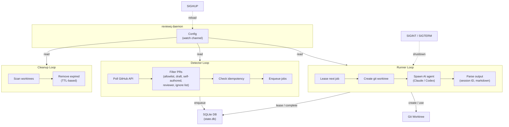

<div align="center">

  <h1>reviewq</h1>

  <h2>Automatic PR review queue powered by AI agents</h2>

  <div>
    <a href="https://github.com/K-dash/reviewq/blob/main/LICENSE"></a>
    <a href="https://www.rust-lang.org/"></a>
    <a href="https://github.com/K-dash/reviewq/graphs/commit-activity"></a>
  </div>

  <p>
    <a href="#features">Features</a>
    &#9670; <a href="#quick-start">Quick Start</a>
    &#9670; <a href="#usage">Usage</a>
    &#9670; <a href="#configuration">Configuration</a>
    &#9670; <a href="#architecture">Architecture</a>
  </p>
</div>

---

## Features

- **Automatic PR detection** &mdash; Polls GitHub for PRs where you are a requested reviewer
- **AI-powered reviews** &mdash; Triggers [Claude Code](https://docs.anthropic.com/en/docs/claude-code) or [Codex](https://openai.com/index/codex-cli/) agents to review code
- **Interactive TUI** &mdash; Monitor job queue, view review output, copy session IDs, and open PRs in browser
- **Hot-reloadable config** &mdash; Send `SIGHUP` to apply config changes without restarting
- **Per-repo policies** &mdash; Customize agent, model, prompt, and filtering rules per repository
- **Worktree isolation** &mdash; Each review runs in its own git worktree for safe concurrent execution
- **Graceful shutdown** &mdash; Staged signal escalation (SIGINT &#8594; SIGTERM &#8594; SIGKILL) for clean process cleanup

## Quick Start

```bash
# 1. Install
cargo install --path .

# 2. Create config
mkdir -p ~/.reviewq
cat > ~/.reviewq/config.yml << 'EOF'
repos:
  allowlist:
    - repo: your-org/your-repo
EOF

# 3. Run the daemon
reviewq
```

> **Prerequisites**: Rust toolchain, `gh` CLI (authenticated) or `GITHUB_TOKEN` env var, and `claude` or `codex` CLI installed.

## Usage

### Daemon mode (default)

```bash
# Start with default config (~/.reviewq/config.yml)
reviewq

# Start with explicit config
reviewq --config /path/to/config.yml
```

### Subcommands

```bash
# Show review job queue
reviewq status
reviewq status --status running
reviewq status --repo org/repo

# Tail live logs for a job
reviewq tail <job-id>

# Open a PR in the browser by job ID or URL
reviewq open <job-id>
reviewq open https://github.com/org/repo/pull/123

# Launch the interactive TUI
reviewq tui
```

### Signals

| Signal    | Effect                                     |
|-----------|--------------------------------------------|
| `SIGHUP`  | Reload configuration from disk             |
| `SIGINT`  | Graceful shutdown (drains in-flight jobs)   |
| `SIGTERM` | Graceful shutdown (drains in-flight jobs)   |

## Configuration

Config file location: `--config` flag > `~/.reviewq/config.yml` (default).

The config is split into two top-level sections:

- `daemon:` — resources that exist once per reviewq installation
  (state DB, poll loop, auth credential, worktree root, global semaphore,
  log / output directories). There is no per-repo equivalent.
- `repos:` — repository-level policy. `repos.defaults` acts as a template
  for every entry in `repos.allowlist`; individual entries can override
  any field. Fields that neither `defaults` nor the entry sets fall back
  to a built-in constant.

Below is a complete reference with all options and their defaults.

```yaml
# ──────────────────────────────────────────────
# daemon — One-per-install resources & daemon behavior
# ──────────────────────────────────────────────
daemon:
  polling:
    interval_seconds: 300                  # Seconds between detection cycles (default: 300)

  auth:
    method: gh                             # "gh" uses `gh auth token` (default: "gh")
    fallback_env: GITHUB_TOKEN             # Env var fallback if gh CLI fails (default: "GITHUB_TOKEN")

  execution:
    worktree_root: ~/.reviewq/worktrees    # Directory for git worktrees (default: ~/.reviewq/worktrees)
    max_concurrency: 10                    # Global semaphore: max concurrent review jobs (default: 10)
    lease_minutes: 5                       # Job lease timeout in minutes (default: 5)

  cancel:
    sigint_timeout_seconds: 5              # SIGINT grace period (default: 5)
    sigterm_timeout_seconds: 15            # SIGTERM grace period (default: 15)
    sigkill_timeout_seconds: 5             # SIGKILL wait after SIGTERM (default: 5)

  cleanup:
    # Worktree retention period in minutes (default: 1440 = 24h).
    # The cleanup loop queries the DB for terminal jobs older than this
    # and `git worktree remove`s each one using its owning repo's
    # `base_repo_path` (resolved via `repos.defaults` → entry override),
    # so installs whose `repos.allowlist[]` entries point at different
    # local clones are all swept correctly. A second "orphan pass"
    # removes leftover `reviewq-*` directories that have no DB row.
    ttl_minutes: 1440
    interval_minutes: 30                   # Cleanup check interval in minutes (default: 30)

  logging:
    dir: ~/.reviewq/logs                   # Log directory (default: ~/.reviewq/logs)

  state:
    sqlite_path: ~/.reviewq/state.db       # SQLite database path (default: ~/.reviewq/state.db)

  output:
    dir: ~/.reviewq/output                 # Review output directory (default: ~/.reviewq/output)

# ──────────────────────────────────────────────
# repos — Repository allowlist and policy (REQUIRED)
# ──────────────────────────────────────────────
repos:
  # Optional: defaults for every entry in `allowlist`. Each field here
  # inherits into allowlist entries that don't set the same field. Anything
  # neither `defaults` nor the entry sets falls back to the built-in value.
  defaults:
    skip_self_authored: true               # Skip PRs you authored (built-in: true)
    skip_reviewer_check: false             # Process all open PRs regardless of reviewer (built-in: false)
    review_on_push: true                   # Re-review on every push/force-push (built-in: true)
    agent: claude                          # Agent: claude | codex (built-in: claude)
    prompt_template: "Review {pr_url}"     # Prompt template (built-in: structured default)
    model: claude-sonnet-4-5-20250514      # Model passed via --model (built-in: none)
    base_repo_path: ~/src                  # Base path for local clones (built-in: none)
    ignore_prs: []                         # PR numbers to exclude (built-in: [])

  allowlist:
    - repo: owner/repo-name                # "owner/name" format (REQUIRED)
      # Any of the fields from `defaults` can be overridden here.
      agent: codex
      model: gpt-5.3-codex
      base_repo_path: /custom/path
      ignore_prs: [100, 200]
```

### Config sections in detail

#### `repos.allowlist` (required)

At least one repository must be listed. Each entry supports the same
fields as `repos.defaults`; anything not set here inherits from
`defaults`, and anything neither sets falls back to the built-in value.

| Field                 | Type        | Built-in | Description |
|-----------------------|-------------|----------|-------------|
| `repo`                | `string`    | &mdash;  | Repository in `"owner/name"` format (**required**) |
| `skip_self_authored`  | `bool`      | `true`   | Skip PRs authored by the authenticated user |
| `skip_reviewer_check` | `bool`      | `false`  | Process all open PRs, not just those with review requested |
| `review_on_push`      | `bool`      | `true`   | Re-review when a new commit is pushed to the PR |
| `agent`               | `string`    | `claude` | Agent: `claude` or `codex` |
| `prompt_template`     | `string`    | built-in | Prompt template (see below) |
| `model`               | `string`    | none     | Model name for the `--model` flag |
| `base_repo_path`      | `path`      | none     | Path to local clone of this repo |
| `ignore_prs`          | `[integer]` | `[]`     | PR numbers to exclude from review |

#### `repos.defaults.agent`

Selects the AI review agent. Each agent has a built-in default command:

| Agent    | Default command |
|----------|----------------|
| `claude` | `claude -p "$(cat "{prompt_file}")" --output-format json --allowedTools Read Grep Glob Bash WebFetch WebSearch Agent Skill` |
| `codex`  | `codex exec --json --sandbox danger-full-access - < "{prompt_file}"` |

**Resolution chain**: `RepoEntry.agent` > `repos.defaults.agent` > built-in `claude`.

#### `repos.defaults.model`

Specifies the model to pass via the `--model` CLI flag.

**Resolution chain**: `RepoEntry.model` > `repos.defaults.model` > omitted (no `--model` flag).

Model names must match `[A-Za-z0-9._:-]+`.

```yaml
repos:
  defaults:
    agent: claude
    model: claude-sonnet-4-5-20250514    # Inherited by every entry below

  allowlist:
    - repo: org/repo-a                   # Uses claude-sonnet-4-5-20250514
    - repo: org/repo-b                   # Overrides both
      agent: codex
      model: gpt-5.3-codex
```

#### `repos.defaults.prompt_template`

Custom prompt body appended after the built-in PR info header. Supports template variables:

| Variable           | Value |
|--------------------|-------|
| `{pr_url}`         | `https://github.com/owner/repo/pull/123` |
| `{repo}`           | `owner/repo` |
| `{pr_number}`      | PR number |
| `{head_sha}`       | Head commit SHA |
| `{worktree_path}`  | Path to the git worktree |
| `{job_id}`         | Internal job ID |
| `{output_path}`    | Path to `REVIEW.md` in the worktree |

When no `prompt_template` is set, a built-in default prompt is used that produces structured review output with severity levels.

**Resolution chain**: `RepoEntry.prompt_template` > `repos.defaults.prompt_template` > built-in default.

#### `review_on_push`

Controls whether SHA changes (force-pushes or additional commits) trigger a re-review.

| Value | Behavior |
|-------|----------|
| `true` (default) | Every push triggers a new review |
| `false` | A PR with a prior **succeeded** review is not re-queued. In-flight reviews on stale SHAs are still canceled. Failed/canceled reviews remain eligible for retry. |

```yaml
repos:
  allowlist:
    - repo: org/big-monorepo
      review_on_push: false       # Review only once per PR
    - repo: org/small-repo        # Default: re-review on every push
```

#### `ignore_prs`

Excludes specific PR numbers from review. Useful for long-lived or legacy PRs you never want auto-reviewed.

```yaml
repos:
  allowlist:
    - repo: org/repo
      ignore_prs: [9520, 9521, 9522]
```

Ignored PRs are filtered out before any other processing. The setting is hot-reloadable via `SIGHUP`.

#### `auth`

GitHub token resolution order:

1. `gh auth token` (when `method: gh`)
2. Environment variable specified by `fallback_env` (default: `GITHUB_TOKEN`)

### Environment variables

The following `REVIEWQ_*` environment variables are injected into every review agent process:

| Variable              | Value |
|-----------------------|-------|
| `REVIEWQ_PR_URL`      | Full PR URL |
| `REVIEWQ_REPO`        | `owner/repo` |
| `REVIEWQ_PR_NUMBER`   | PR number |
| `REVIEWQ_HEAD_SHA`    | Head commit SHA |
| `REVIEWQ_WORKTREE_PATH` | Worktree directory |
| `REVIEWQ_JOB_ID`      | Internal job ID |
| `REVIEWQ_OUTPUT_PATH`  | Path to `REVIEW.md` |
| `REVIEWQ_PROMPT`      | Rendered prompt (omitted if > 128KB) |
| `REVIEWQ_PROMPT_FILE` | Path to prompt file (always set) |

### Hot reload

Send `SIGHUP` to reload the config file without restarting:

```bash
kill -HUP $(cat ~/.reviewq/logs/reviewq.pid)
```

Changes to the following fields take effect immediately:
- `repos.allowlist` (repos, per-repo settings)
- `repos.defaults` (prompt_template, model, base_repo_path, etc.)
- `daemon.polling.interval_seconds`
- `daemon.cleanup` settings
- `daemon.output.dir`

Changes to these fields require a restart:
- `daemon.auth`
- `daemon.execution.max_concurrency`
- `daemon.execution.lease_minutes`
- `daemon.cancel`
- `daemon.logging`
- `daemon.state`

## Architecture


```mermaid
graph TD
    subgraph Daemon["reviewq daemon"]
        Config["Config<br/>(watch channel)"]
    end

    Config -->|"read"| Detector
    Config -->|"read"| Runner
    Config -->|"read"| Cleanup

    subgraph Detector["Detector Loop"]
        D1["Poll GitHub API"]
        D2["Filter PRs<br/>(allowlist, draft, self-authored,<br/>reviewer, ignore list)"]
        D3["Check idempotency"]
        D4["Enqueue jobs"]
        D1 --> D2 --> D3 --> D4
    end

    subgraph Runner["Runner Loop"]
        R1["Lease next job"]
        R2["Create git worktree"]
        R3["Spawn AI agent<br/>(Claude / Codex)"]
        R4["Parse output<br/>(session ID, markdown)"]
        R1 --> R2 --> R3 --> R4
    end

    subgraph Cleanup["Cleanup Loop"]
        C1["Scan worktrees"]
        C2["Remove expired<br/>(TTL-based)"]
        C1 --> C2
    end

    Detector -->|"enqueue"| DB["SQLite DB<br/>(state.db)"]
    Runner -->|"lease / complete"| DB
    Runner -->|"create / use"| WT["Git Worktree"]

    SIGHUP["SIGHUP"] -.->|"reload"| Config
    SIGINT["SIGINT / SIGTERM"] -.->|"shutdown"| Runner
```

**Detector** polls GitHub API at configured intervals, applies filtering rules (allowlist, draft, self-authored, reviewer assignment, ignore list), checks idempotency, and enqueues new review jobs.

**Runner** leases jobs from the queue, creates isolated git worktrees, spawns the configured AI agent, and captures output. Supports concurrent execution with configurable limits.

**Cleanup** periodically removes expired worktrees based on TTL settings.

All three loops read configuration from a shared watch channel, allowing hot-reload via `SIGHUP`.

## Development

```bash
make all      # format + lint + test
make fmt      # cargo fmt
make lint     # cargo clippy -- -D warnings
make test     # cargo test
```

## License

MIT OR Apache-2.0
